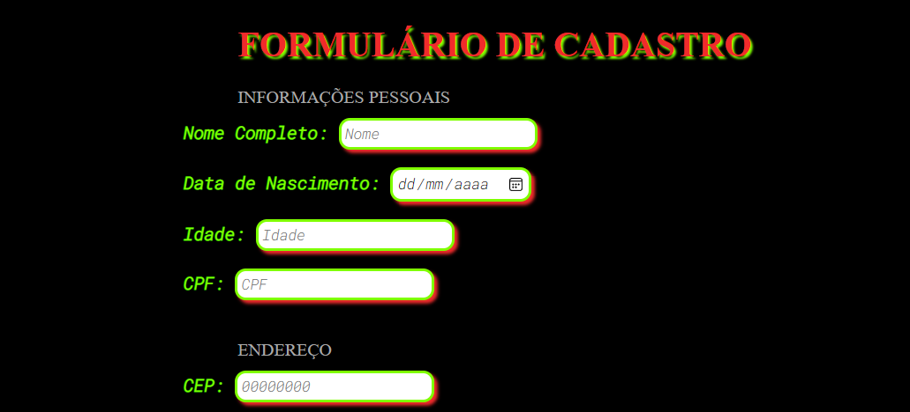

# FORMULÁRIO DE CADASTRO

## 🕵️‍♀️Sobre 
O objetivo do projeto é **cadastrar** as **informações pessoais** e **endereço** do **usuário**

## ⚙️Tecnologias Utilizadas

- HTML
- CSS
- JavaScript

## 👨‍💻Desafio

- Criar um form com os campos: (Nome / CPF / Data de Nascimento / Idade / CEP / Rua / Número / Bairro / Cidade / Estado / Hobby / Checkbox aceite LGPD / Botão submit)

- Integrar o campo CEP com a API: https://viacep.com.br

- Validação do CEP

- Ao clicar no butão submit, verificar se foi aceito o LGPD e se as informações foram preenchidas e são válidas

## Contato

